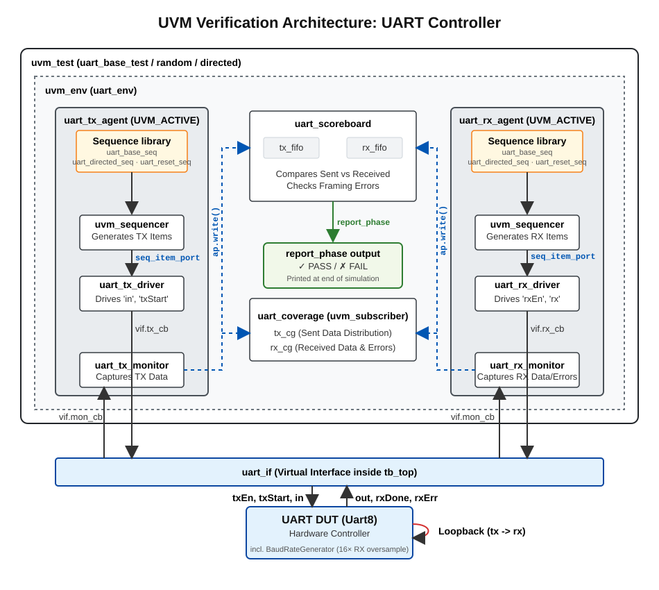
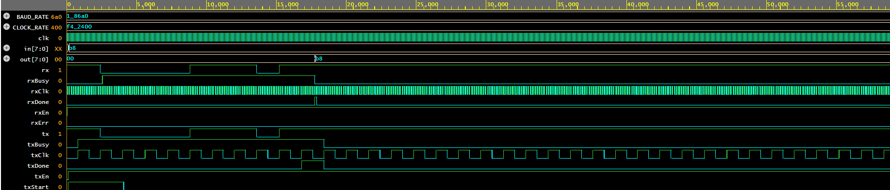

# UART UVM Verification Testbench

A complete **UVM (Universal Verification Methodology)** testbench for an 8-bit UART design written in SystemVerilog. The project verifies a full UART subsystem comprising a baud rate generator, an 8-bit receiver, and an 8-bit transmitter using a structured, layered UVM environment.

---

## Table of Contents

- [Overview](#overview)
- [UVM Testbench Architecture](#uvm-testbench-architecture)
- [DUT Architecture](#dut-architecture)
- [Features](#features)
- [Getting Started](#getting-started)
- [Test Suite](#test-suite)
- [Coverage](#coverage)
- [Parameters](#parameters)
- [Scoreboard](#scoreboard)
- [Simulation Validation](#simulation-validation)
---

## Overview

This repository contains a full UVM verification environment for a parameterisable 8-bit UART. The DUT implements:

- One start bit, 8 data bits, one stop bit (8N1 framing)
- A baud rate generator that divides the board clock into TX and RX clocks, with the RX clock running at **16× oversample** for robust sampling
- Separate `enable` signals for TX and RX paths
- A `busy` flag and a single-cycle `done` pulse on both transmit and receive completion
- An `err` flag on the receiver for framing errors

The testbench uses a **loopback topology** — the `tx` output of the DUT is wired back to its own `rx` input — allowing end-to-end verification of both paths simultaneously with a single TB.

---
## UVM Testbench Architecture

The diagram below shows the full structure of the verification environment — 
how stimulus flows from test scenarios down through agents to the hardware, 
and how results flow back up through the scoreboard.



---
## DUT Architecture

```
                        ┌─────────────────────────────────────┐
                        │              Uart8                  │
                        │                                     │
  clk ────────────────► │  ┌──────────────────────────────┐   │
  txEn, txStart, in ──► │  │     Uart8Transmitter         │ ──┼──► tx
                        │  └──────────────────────────────┘   │
                        │                                     │
                        │  ┌──────────────────────────────┐   │
  rx ─────────────────► │  │     Uart8Receiver            │ ──┼──► out, rxDone, rxBusy, rxErr
  rxEn ───────────────► │  └──────────────────────────────┘   │
                        │                                     │
                        │  ┌──────────────────────────────┐   │
                        │  │    BaudRateGenerator         │   │
                        │  │  rxClk (16× oversample)      │   │
                        │  │  txClk (1× baud)             │   │
                        │  └──────────────────────────────┘   │
                        └─────────────────────────────────────┘
```

| Parameter   | Default       | Description                        |
|-------------|---------------|------------------------------------|
| CLOCK_RATE  | 16_000_000    | Board internal clock frequency (Hz)|
| BAUD_RATE   | 100_000       | Serial baud rate                   |

---


## Features

- Full UVM 1.2 compliant layered architecture
- Parameterisable for any clock rate and baud rate
- **Loopback topology** — TX output wired to RX input for end-to-end verification
- Scoreboard with per-transaction data integrity and framing error checks
- Functional coverage on all 256 byte values, alternating patterns, and error conditions
- Timeout watchdog guard on every transaction
- Three reusable test classes (base, random, directed)
- Clean pass/fail summary printed at end of simulation
- VCD waveform dump for post-simulation debug

---
## Getting Started
With a simulator that supports UVM 1.2 (Cadence Xcelium, Synopsys VCS, Aldec Riviera-PRO, or Mentor Questa):

```bash
# Compile and Run Command
 xrun -Q -unbuffered '-timescale' '1ns/1ns' '-sysv' '-coverage' 'all' '-access' '+rw' '-covoverwrite' '-svseed' 'random' -uvmnocdnsextra
           -uvmhome $UVM_HOME $UVM_HOME/src/uvm_macros.svh 
           design.sv 
           testbench.sv  
```
---

## Test Suite

| Test                  | Description                                                             |
|-----------------------|-------------------------------------------------------------------------|
| `uart_base_test`      | Sends a single constrained-random byte and verifies loopback            |
| `uart_random_test`    | Sends N random bytes back-to-back (default 10, override with `+num_tx=`)|
| `uart_directed_test`  | Sends a User input value                                                |

Each test checks:
- Received byte matches transmitted byte
- No framing error (`rxErr == 0`)
- `rxDone` pulses for each received byte

---

## Coverage

The `uart_coverage` subscriber collects:

**TX coverage** — byte values driven into the DUT:

| Bin         | Value(s)          |
|-------------|-------------------|
| `zero`      | `0x00`            |
| `ones`      | `0xFF`            |
| `alt_10`    | `0xAA`            |
| `alt_01`    | `0x55`            |
| `lsb_only`  | `0x01`            |
| `msb_only`  | `0x80`            |
| `rest[8]`   | All other values  |

**RX coverage** — bytes observed on the output, crossed with `rxErr`.

Coverage percentages are reported at end of simulation:

```
[COV] TX functional coverage = 92.9% | RX functional coverage = 72.2%
```

---

### Key signals to probe:

| Signal             | Description                          |
|--------------------|--------------------------------------|
| `clk`              | 100 MHz board clock                  |
| `dut_if.txStart`   | TX transaction trigger               |
| `dut_if.tx`        | Serial bitstream out of transmitter  |
| `dut_if.rxDone`    | Pulse when receiver completes        |
| `dut_if.out[7:0]`  | Received byte                        |
| `dut_if.rxErr`     | Framing error flag                   |

---

## Parameters

Both the DUT and the testbench top are parameterisable. To verify at a different baud rate, change the parameters in `tb_top.sv`:

```systemverilog
parameter CLOCK_RATE = 16_000_000;  // match your FPGA board clock
parameter BAUD_RATE  = 100_000;       // change to desired baud rate
```
---

## Scoreboard
```text
============ Scoreboard Summary ============
PASS : 1000
FAIL : 0
============================================
```
---

## Simulation Validation
Below is a waveform trace showing a successful 8-bit transaction where the transmitted data `0xB8` is correctly captured and validated by the receiver.

